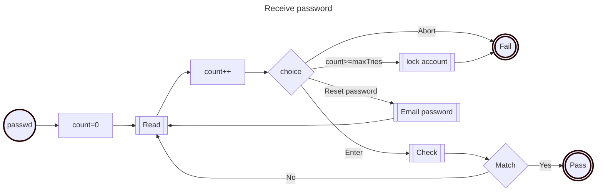
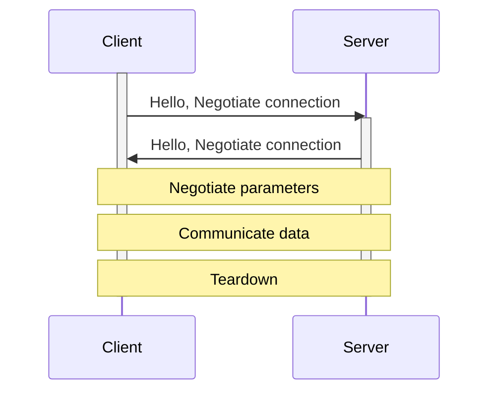
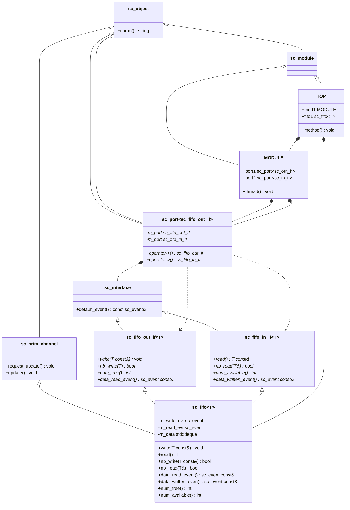
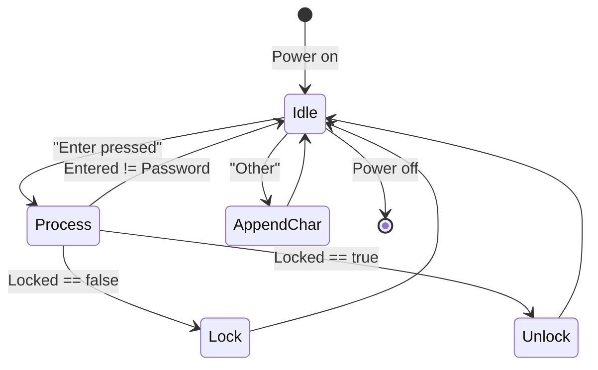
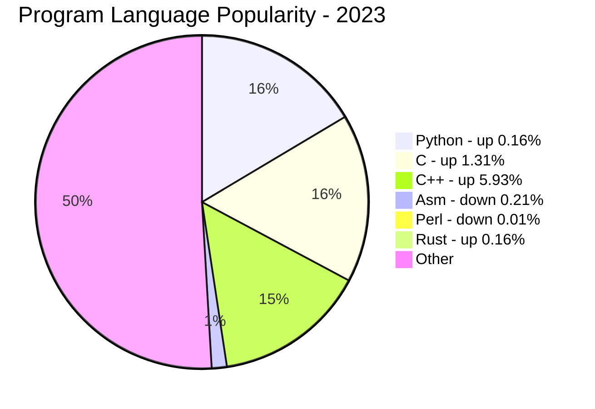
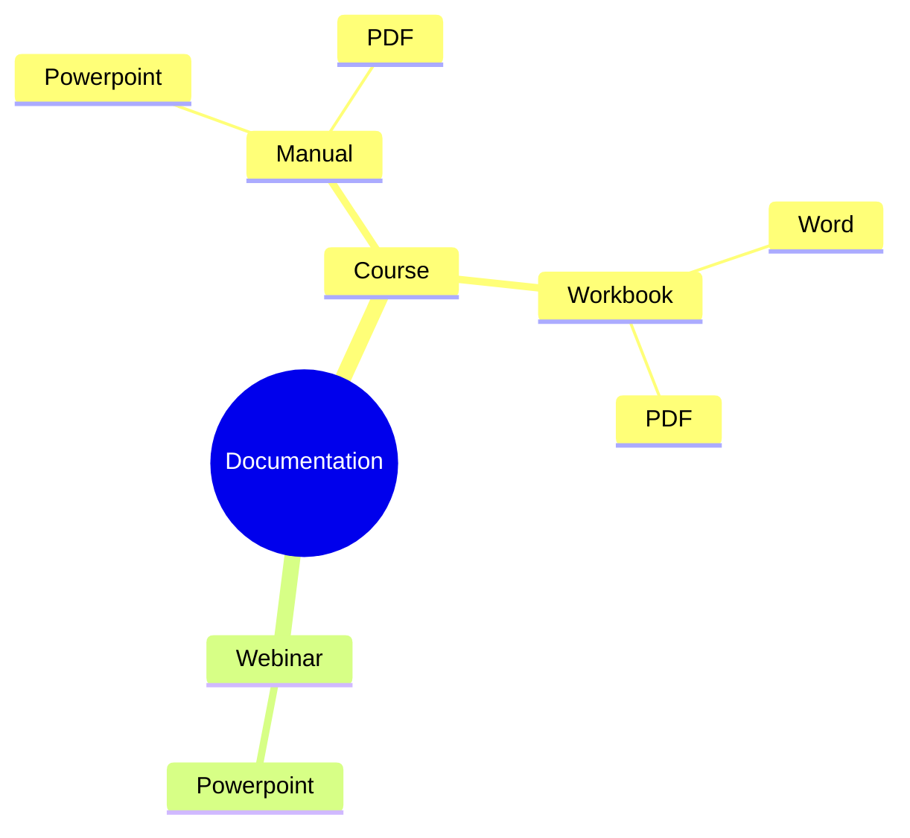
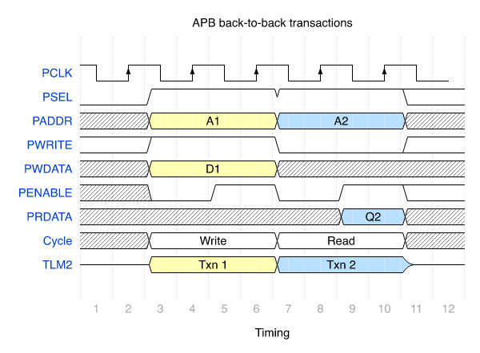

# Typora Example

This is a *simple* **example** of some **Markdown** to illustrate the power of Typora from https://typora.io. Look at this text using a plain text editor (e.g., Notepad or Vim) and Typora. I have included exported versions of this text unaltered with this.

Insert a table of contents by removing the X in the following (Click to jump):

[tocX]

## Basics

You can create **bold**, *italic*, ***bold-italic***, <u>underlined</u>, ==highlighted==, or even `inline code` as you write using familiar editing sequences, such as in Microsoft Word. Footnotes[^1] are possible. Control/Command-click on the footnote to jump directly to it.

> Or quotations of something off the web. URLs such as https://www.doulos.com is automatically figured out.
>

Copyright © 2023 Doulos Ltd. All rights reserved.


#### Math equations are [relatively easy](https://support.typora.io/Math/) :

$\lim_{x \to \infty} \exp(-x) = 0$

$magnitude = \sqrt{x^2 + y^2}$

$power = \int_{t=0}^{n}v_t f(t)$

#### Lists

Allowing slides with

- Bullets
  - And sub-bullets

1. Such as this
   1. Even ordered lists
   1. Numbering is automatic
2. At different levels
   - Or unordered sub-lists

- [ ] Tasks
  - [ ] With things to do
  - [x] Can be checked off

#### Tables are a breeze

| Terminology | Meaning                                    |
| ----------- | ------------------------------------------ |
| Ordered     | Numbered items automatically updated       |
| Unordered   | Bulleted lines used for lists              |
| Tasks       | Check boxes that can be easily checked off |

#### Graphics images

Supported either locally or from the web with scaling allowed. Usually, just drag-n-drop.

- Example 1, a simple PNG (jpeg works too). The graphic needs to be sent with the Markdown, usually in a folder named DOCNAME.assets.


#### Embedded videos:

<!-- Change iframe to xframe in the following to allow export in Word -->

<iframe width="560" height="315" src="https://www.youtube.com/embed/K1gKJdC4WYA" title="YouTube video player" frameborder="0" allow="accelerometer; autoplay; clipboard-write; encrypted-media; gyroscope; picture-in-picture; web-share" allowfullscreen></iframe>


For complex stuff, you can use HTML natively, such as <span style="color:red;">RedText</span>.

## Source Code

You can also create code blocks, as shown below. There are MANY languages supported. I include samples of some that we use here.

### VHDL

```vhdl
use std.textio.all;

entity hello_world is
end hello_world;

architecture behaviour of hello_world is
begin
    process
    begin
       write (output, String'("Hello world!"));
       wait;
    end process;
end behaviour;
```

### SystemVerilog

```systemverilog
module hello_world;
  initial begin
    $display( "Hello world!" );
  end
endmodule
```

### C

```c
#include <stdio.h>
int main() {
  printf( "Hello world!\n" );
}
```

### C++

```c++
#include <format> // C++20
int main() {
  std::print( "Hello world!\n" );
}
```

### Rust

```rust
fn main() {
    println!("Hello World!");
}
```


### Python

```python
#!/usr/bin/env python
print "Hello World!"
```

### Bash

```bash
#!/usr/bin/env bash
echo "Hello world!"
```

### TCL

```tcl
#!/usr/bin/env tclsh
puts "Hello world!"
```

### Assembly

```assembly
.section ".text"
__start:
    ADD r0, r0, lsl #2  // r0 *= 5;
    BX LR
.end  
```


## Diagrams

Diagrams are supported using [mermaid](https://mermaid.js.org/intro/) using an extension to Markdown. Simply enter a code block using the language `mermaid` and start with an type indicator. Here are some examples.

### Flow Charts

Using a `mermaid` code-block show a `flowchart` thusly.



### UML

#### Sequence diagrams

Using a `mermaid` code-block show a `sequenceDiagram` thusly.



#### Class diagrams

Using a `mermaid` code-block show a `classDiagram` thusly.



#### State diagrams

Using a `mermaid` code-block show a `stateDiagram` thusly.



### Pie charts

Using a `mermaid` code-block show a `pie` thusly.




### Mindmap



[^1]: This is a simple example of a footnote.

### Waveforms

For now, it has to be a simple graphic generated with [WaveDrom](https://wavedrom.com). However, support for WaveDrom has been requested and should not be too difficult to incorporate.



## That's all folks
